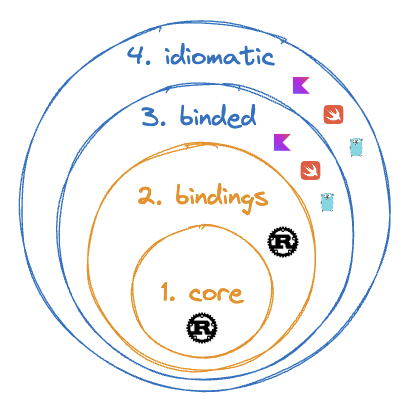

# Work in progress

This repo is not ready for consumption, and is under heavy development

## The "Onion"

- `core` is unbridled rust code, without compromise for outer layers
- `bindings` is rust code to make bindings possible
- `binded` is non-rust code without concern for idioms
- idiomatic is the expressive non-rust project, well-rounded, intended for developer consumption