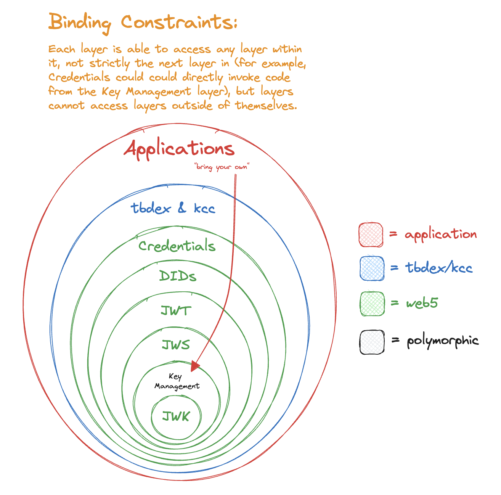

> [!WARNING]
> This is currently a WIP

🚧 Under Construction 🚧
- Can we make `jws_signer` work?
- No circular dependencies
- No peer dependencies (unsure about how this would work in practice, at a minimum DX cannot include determining version compatibility)
- No optional parameters, create new functions if multiple functionalities are needed
- No bleeding abstractions from transitive dependencies
- Terminology
- Packages
- Package dependencies
- Error cases
- What about generics or extending data models? (ex. JWT registered claims + `vc` or `vp` claim)
- "Bring your own key manager"
- There's no way around exposing a jose for two reasons: 
  - JWK is part of the DID Core spec
  - KCC needs decoded jose headers & JWT claims in order to operate
  - We cannot bleed abstractions from underlying dependencies
- consider moving entirely away from `key_alias` to `key_id`
- consider `PrivateJwk` and `PublicJwk`
- why split `KeySigner` & `KeyImporter` away from `KeyManager`?
- can we in some way incorporate namespacing here, as a means of constraining scope? for example, would be nice to just have `Jwt` and have it under a `dids` namespace, which would indicate that's a JWT concept constrained to within the concept of a DID.
- a bunch of examples

# Web5 API Design <!-- omit in toc -->

- [JWK](#jwk)
  - [`Jwk` (class)](#jwk-class)
- [Key Management](#key-management)
  - [`KeyManager` (interface)](#keymanager-interface)
  - [`Curve` (enum)](#curve-enum)
- [JWS](#jws)
  - [`Jws` (class)](#jws-class)
  - [`JwsHeader` (class)](#jwsheader-class)
- [JWT](#jwt)
  - [`Jwt` (class)](#jwt-class)
  - [`JwtClaims` (class)](#jwtclaims-class)
- [DIDs](#dids)
  - [`Identifier` (class)](#identifier-class)
  - [`Document` (class)](#document-class)
  - [`DocumentMetadata` (class)](#documentmetadata-class)
  - [`ResolutionMetadata` (class)](#resolutionmetadata-class)
  - [`Resolution` (class)](#resolution-class)
  - [`BearerDid` (class)](#bearerdid-class)
  - [`DidJwk` (class)](#didjwk-class)
  - [`DidWeb` (class)](#didweb-class)
  - [`DidDht` (class)](#diddht-class)
- [Credentials](#credentials)
  - [`VerifiableCredential` (class)](#verifiablecredential-class)

# JWK

## `Jwk` (class)

Data properties conformant with [RFC7517](https://datatracker.ietf.org/doc/html/rfc7517).

| Function                             | Notes                                  |
| ------------------------------------ | -------------------------------------- |
| `compute_thumbprint(self) -> string` | RECOMMENDED to be used as a key alias. |

# Key Management

## `KeyManager` (interface)

| Function                                                   | Notes                                    |
| ---------------------------------------------------------- | ---------------------------------------- |
| `generate_private_key(self, curve: Curve) -> string`       | Return string is equal to the key alias. |
| `get_public_key(self, key_alias: string) -> Jwk`           |                                          |
| `sign(self, key_alias: string, payload: []byte) -> []byte` |                                          |

## `Curve` (enum)

Open Issue [#38](https://github.com/TBD54566975/web5-rs/issues/38).

| Value       |
| ----------- |
| `Ed25519`   |
| `Secp256k1` |

# JWS

## `Jws` (class)

| Function                                                                                    | Notes |
| ------------------------------------------------------------------------------------------- | ----- |
| `create_compact_jws(header: JwsHeader, payload: []byte, key_manager: KeyManager) -> string` |       |
| `verify_compact_jws(compact_jws: string, public_key: Jwk) -> bool`                          |       |

## `JwsHeader` (class) 

Data properties conformant with [Section 4. of RFC7515](https://datatracker.ietf.org/doc/html/rfc7515#section-4).

| Function                                             | Notes |
| ---------------------------------------------------- | ----- |
| `from_compact_jws(compact_jws: string) -> JwsHeader` |       |

# JWT

## `Jwt` (class)

| Function                                                                                             | Notes |
| ---------------------------------------------------------------------------------------------------- | ----- |
| `create_as_compact_jws(jws_header: JwsHeader, claims: JwtClaims, key_manager: KeyManager) -> string` |       |
| `verify(jwt: string, public_key: Jwk) -> bool`                                                       |       |

## `JwtClaims` (class)

Data properties conformant to [RFC7519](https://datatracker.ietf.org/doc/html/rfc7519#section-4).

| Function                             | Notes |
| ------------------------------------ | ----- |
| `from_jwt(jwt: string) -> JwtClaims` |       |

# DIDs

## `Identifier` (class)

| Property                      | Notes |
| ----------------------------- | ----- |
| `uri: string`                 |       |
| `url: string`                 |       |
| `method: string`              |       |
| `id: string`                  |       |
| `params: map<string, string>` |       |
| `path: string`                |       |
| `query: string`               |       |
| `fragment: string`            |       |

| Function                               | Notes |
| -------------------------------------- | ----- |
| `parse(did_uri: string) -> Identifier` |       |

## `Document` (class)

Data properties conformant to [DID Document Data Model
 in the web5-spec](https://github.com/TBD54566975/web5-spec/blob/main/spec/did.md#did-document-data-model).

## `DocumentMetadata` (class)

Data properties conformant to the [DID Document Metadata Data Model in the web5-spec](https://github.com/TBD54566975/web5-spec/blob/main/spec/did.md#did-document-metadata-data-model).

## `ResolutionMetadata` (class)

Data properties conformant to [DID Resolution Metadata Data Model in the we5-spec](https://github.com/TBD54566975/web5-spec/blob/main/spec/did.md#did-resolution-metadata-data-model).

## `Resolution` (class)

| Property                                  | Notes |
| ----------------------------------------- | ----- |
| `document: Document`                      |       |
| `document_metadata: DocumentMetadata`     |       |
| `resolution_metadata: ResolutionMetadata` |       |

| Function                                 | Notes |
| ---------------------------------------- | ----- |
| `resolve(did_uri: string) -> Resolution` |       |

## `BearerDid` (class)

| Property                  | Notes |
| ------------------------- | ----- |
| `identifier: Identifier`  |       |
| `document: Document`      |       |
| `key_manager: KeyManager` |       |

| Function                                                                                                  | Notes |
| --------------------------------------------------------------------------------------------------------- | ----- |
| `sign_jwt_as_compact_jws(self, jws_header: JwsHeader, claims: JwtClaims, verification_method_id: string)` |       |

## `DidJwk` (class)

| Function                                                     | Notes |
| ------------------------------------------------------------ | ----- |
| `create(key_manager: KeyManager, curve: Curve) -> BearerDid` |       |
| `resolve(did_uri) -> Resolution`                             |       |

## `DidWeb` (class)

| Function                         | Notes |
| -------------------------------- | ----- |
| `resolve(did_uri) -> Resolution` |       |

## `DidDht` (class)

| Function                         | Notes |
| -------------------------------- | ----- |
| `resolve(did_uri) -> Resolution` |       |

# Credentials

## `VerifiableCredential` (class)

Data properties conformant to [Verifiable Credential Data Model in the web5-spec](https://github.com/TBD54566975/web5-spec/blob/main/spec/vc.md#verifiable-credential-data-model).

| Function                                                                            | Notes |
| ----------------------------------------------------------------------------------- | ----- |
| `sign_vcjwt(self, bearer_did: BearerDid, verification_method_id: string) -> string` |       |
| `verify_vcjwt(vcjwt: string) -> VerifiableCredential`                               |       |