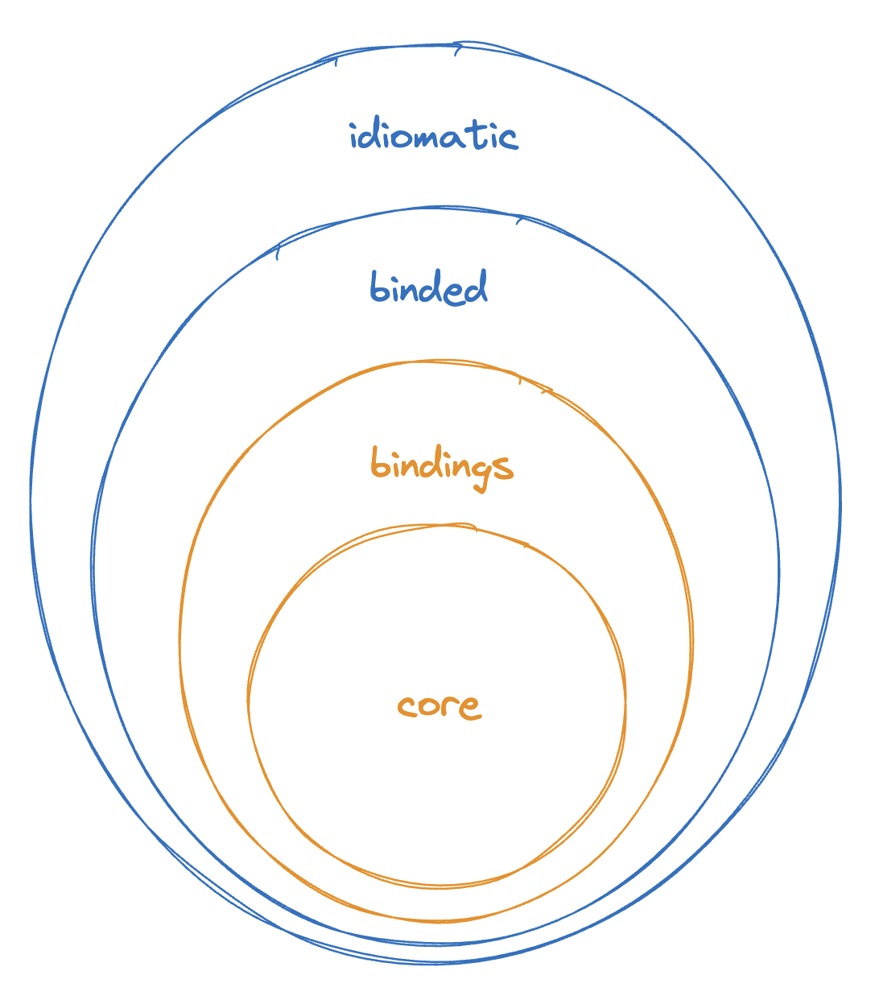
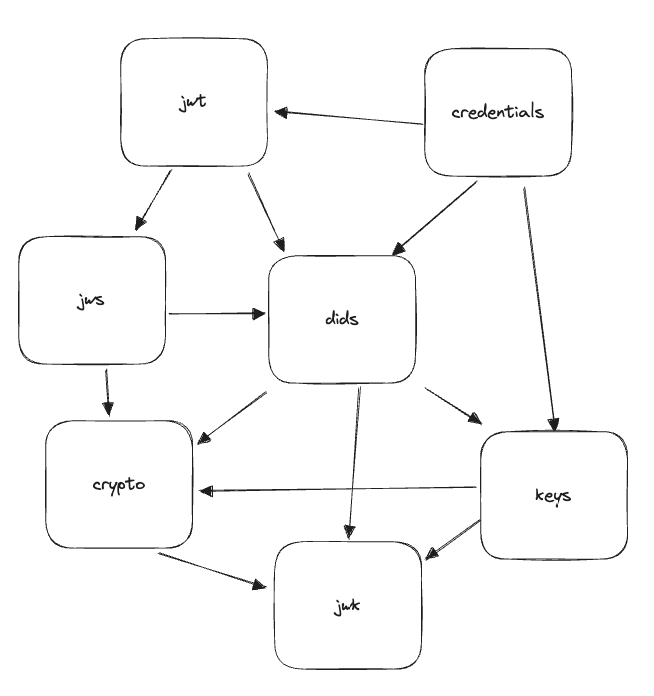
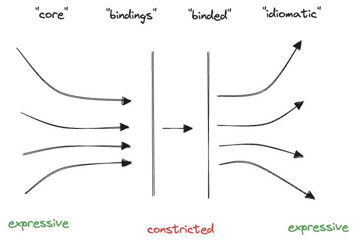

# Contributor Getting Started

## The "Onion"

- `core` is unbridled rust code, without compromise for outer layers
- `bindings` is rust code to make bindings possible
- `binded` is non-rust code without concern for idioms
- idiomatic is the expressive non-rust project, well-rounded, intended for developer consumption

### `core`

`core` is where the uncompromising web5 rust code exists, without regard for binding. No circular dependencies shall exist. See each crate for more information.

### `bindings`

`bindings` is where rust code exist for the purposes of binding to non-rust languages. This project makes use of [UniFFI](https://github.com/mozilla/uniffi-rs) for building and generating the cross-language bindings.

In the case wherein an unknown type must cross the binding boundary (for example, in JavaScript that would be an `Object` or in Golang that would be an `interface {}`), we make available a custom type called `Unknown`. `Unknown` must be JSON-serializable safe. TODO what is the developer experience on both sides?

### `binded`

`binded` is where the non-rust project exists without concern for idiomatic patterns in the given target language. Each binded project must have comprehensive unit test coverage. Current languages supported:

- Kotlin
- Swift

### idiomatic

Idiomatic is the layer in which the non-rust project is built for developer consumption.

## The Problem of DX & Cross-Language-Binding

